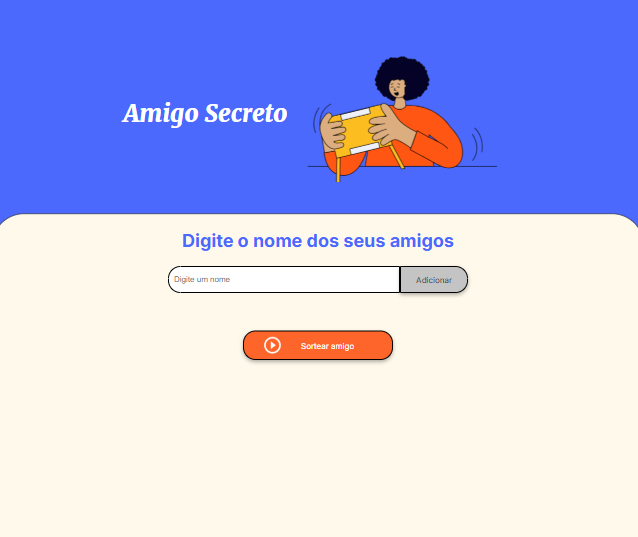

# 🎁 Amigo Secreto

## 📋 Descrição
O **Amigo Secreto** é uma aplicação web simples e interativa desenvolvida para facilitar o sorteio de amigos secretos de forma rápida e divertida. Com um design moderno e intuitivo, a plataforma permite adicionar participantes e realizar o sorteio automaticamente.

Este projeto faz parte do **[Challenge da Alura](https://www.alura.com.br/) em parceria com a [Oracle Next Education (ONE)](https://www.oracle.com/education/)**.

## 🚀 Funcionalidades
- ✅ Adicionar nomes de participantes;
- 🔄 Listar amigos adicionados;
- 🎯 Realizar o sorteio automático de forma justa;
- 📱 Interface responsiva para dispositivos móveis e desktops.

## 🛠️ Tecnologias Utilizadas
- **HTML5**: Estruturação do conteúdo;
- **CSS3**: Estilização da interface com uso de variáveis e design responsivo;
- **JavaScript (JS)**: Lógica do sorteio e manipulação do DOM;
- **Google Fonts**: Tipografias modernas (Inter e Merriweather).

## 📦 Estrutura do Projeto
```
├── index.html        # Estrutura da aplicação
├── style.css         # Estilização da interface
├── app.js            # Lógica do sorteio e interatividade
└── assets/           # Imagens e ícones utilizados
```

## 💡 Como Usar
1. Clone o repositório:
   ```bash
   git clone https://github.com/seu-usuario/amigo-secreto.git
   ```
2. Acesse a pasta do projeto:
   ```bash
   cd amigo-secreto
   ```
3. Abra o arquivo `index.html` no seu navegador preferido.

## 🖼️ Captura de Tela
Adicione aqui uma imagem demonstrando o funcionamento do aplicativo:




## 📄 Licença
Este projeto está sob a licença MIT - veja o arquivo [LICENSE](LICENSE) para mais detalhes.

---
Desenvolvido com 💙 por [- **Maria Viana** - [GitHub](https://github.com/mariaviana) | [LinkedIn](https://linkedin.com/in/mariaviana)].

